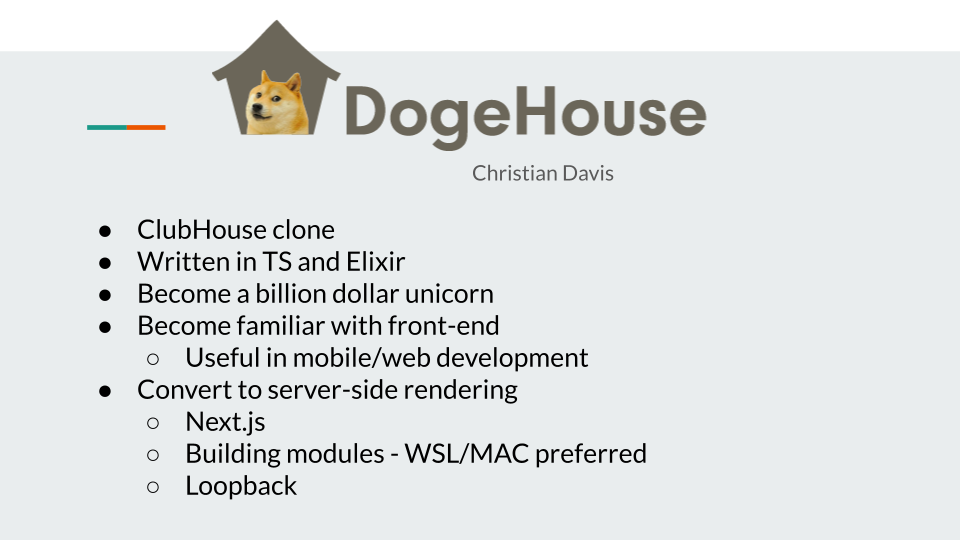
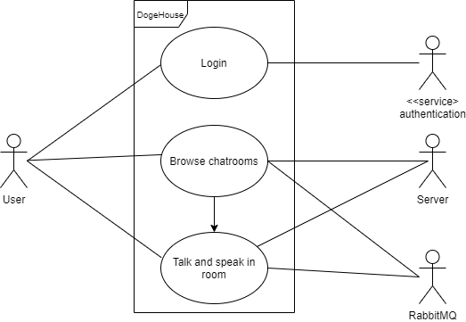

# Project Proposal - Christian Davis - [DogeHouse](https://github.com/benawad/dogehouse.git)

## Project Summary

Dogehouse is an open source Clubhouse clone without the elitism. It's a new project by your favorite programmer's favorite programmer, Ben Awad. Instead of being invite only, the social networking voice app, is open to all users with a GitHub or Twitter account. It also has several things going for it that Clubhouse failed to deliver. It's cross platform, has a dark mode and also supports text chat. The experience is similar to live podcasting. Don't just listen to a topic, be able to actively contribute and be heard.
 
 

## Educational Goals

The project highlights several goals of the class. The project began just last week, but has already amassed 30 watchers and 1.5k ratings. There's several issues already found and since the project is in it's infancy there's bound to be many more discovered as the project continues to gain popularity. In the current curriculum there isn't a class that revolves around databases, something many of us are going to use in our careers. One of the technologies this project requires is PostgreSQL. Another highlight of the project is exposing us to a GUI, markup language and remote calls. Just because of the popularity of the language escaping Javascript, HTML and CSS is impossible. Even working on the backend of a project, knowing how those technologies interact with API's on the backend is a valuable tool. Work on this project will enforce OOP since Typescript is the preferred superset of Javascript for this project. Those are the most important goals of the class highlighted, but honestly work on this project could involve anything on that list. Even elixir is an API built on Erlang, a different way to look at concurrency.
 

## Proposal

The most important feature that's currently missing is to turn this into a SSR (Server Side Rendered) app. In it's current state it's required to login, but anonymous and use not requiring a sign in are current features that are being proposed. While still in it's infancy conversion is easiest to do now, without having to refactor features afterwards. If there is time left over within the six weeks, I would suggest adding in other sign in methods. A native method might be too complex to do in addition to the conversion, but authentication through google, facebook, amazon and other services should be doable.
 
 

## Project Source

I think the hardest part of the project will be getting it to run for everyone. Setup is a little hard and there's a ton of environment variables to set just for the dependencies to install. [Here's](https://github.com/benawad/dogehouse/blob/master/README.md) where you find the README document and the live project can be found by clicking the title at the top. Let's start with the basics, I was able to successfully build the project on Windows 10 and my Macbook. I use WSL on windows for development so if you don't have it, I suggest configuring it with instructions found [here](https://docs.microsoft.com/en-us/windows/wsl/install-win10). I've helped users in 3207 with setting up WSL, so any issues with that I'll do my best to get it configured. You'll also need to install [node.js](https://nodejs.org/en/download/package-manager/#debian-and-ubuntu-based-linux-distributions), which I suggest doing it in WSL. PostgreSQL comes installed in Ubuntu by default, but if you choose a different distribution for WSL or wish to upgrade the current version, [PostgreSQL](https://www.postgresql.org/download/linux/ubuntu/). If you're missing any of those programs, you'll be required to install before you can follow the guide provided within the README. With WSL you'll be using the command line so you can just copy and paste from the links I provided. On my Mac I just downloaded the package, then dragged and dropped as usual. Postgres is a DB that's difficult to setup at first on WSL. I suggest opening another terminal when you need to interact with a database. You can't emulate the backend without an active postgres instance. If you're able to get over those hurdles or use a linux/unix based os, installation in his readme is pretty straight forward. Project is built in elixir and js, so if you're familiar with those you shouldn't have any issues. Again, there's a bunch of environment variables that need to be configured, so you're probably going to get an error a few times just trying to follow along.

